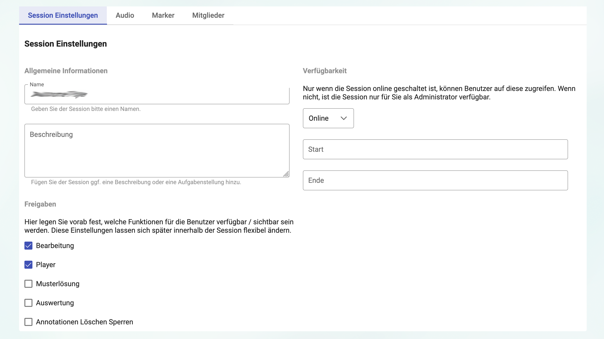

# Sessioneinstellungen {#guide-erste-schritte-sessioneinstellungen}

Bei den Session Einstellungen finden Sie zunächst die allgemeinen Informationen. Hier können Sie den Namen der Session und die Sessionbeschreibung ändern. Die Beschreibung ist eine zusätzliche Angabe und kann beispielsweise eine Aufgabenstellung beinhalten.

Als nächstes finden Sie die Freigaben. Hier können Sie einstellen, welche Funktionen für die Benutzer verfügbar beziehungsweise sichtbar sein sollen (siehe Abbildung \ref{einstellungen}). Diese Einstellungen lassen sich auch während der Session unter dem Menü **Freigaben** flexibel ändern.

1. **Bearbeitung:** Generell lässt sich die Session nur bearbeiten (d.h. mit Annotationen versehen), wenn der Player läuft. Wenn der Player nicht läuft, färben sich die Marker grau und können nicht mehr betätigt werden. Dies geschieht auch, wenn Sie die Bearbeitung deaktivieren. Das ist beispielsweise sinnvoll, wenn Sie die Audio mit den Teilnehmer\*innen anhören wollen, aber noch keine Bearbeitung stattfinden soll.

2. **Player:** Wenn Sie den Player deaktiviert haben, läuft die Audio nur über Ihr Gerät, die Teilnehmer\*innen können keinen Ton auf ihrem Gerät hören aber bei erlaubter Bearbeitung die Marker tätigen. Wenn Sie den Player aktivieren können die Teilnehmer\*innen den Player selbst steuern und die Audio läuft auf den jeweiligen Geräten ab.

3. **Musterlösung:** Wenn Sie die Musterlösung aktivieren, kann die Annotation des Owners als Musterlösung für die Teilnehmer\*innen verwendet werden. Die Teilnehmer\*innen erhalten die Lösung dann in ihrem Auswertungs-Screen zusammen mit ihren eigenen Annotationen. Es empfielt sich, die Freigabe erst nach den Annotationen zu aktivieren. Um die Musterlösung sehen zu können muss außerdem auch die Auswertung aktiviert sein.

4. **Auswertung:** Wenn Sie die Auswertung aktivieren, können die Teilnehmer\*innen ihre Annotationen und die Annotationen der anderen Teilnehmer\*innen sehen und vergleichen. Sie können bearbeiten, welche Annotationen den Teilnehmer\*innen angezeigt werden sollen. Auch hier empfielt sich, die Freigabe erst nach den Annotationen zu aktivieren.

5. **Annotationen Löschen Sperren:** Wenn das Löschen der Annotationen freigegeben ist, können die Teilnehmer\*innen ihre Annotationen durch das Kreuz am Ende der Zeile eines Markers Löschen. Ist das Löschen gesperrt, können Teilnehmer\*/innen ihre Annotationen nicht mehr entfernen. Die Funktion kann zum Beispiel dann interessant sein, wenn Sie einen spontanen ersten Eindruck von den Teilnehmer\*innen einfangen wollen oder die Session innerhalb einer Prüfung verwenden.

Zum Schluss können Sie noch die Verfügbarkeit der Session bearbeiten. Nur wenn die Session _Online_ ist, können Benutzer\*innen auf diese zugreifen. Wenn nicht, ist die Session nur für Sie als Administrator sichtbar. Sie können den Status auf _Im Aufbau_, _Online_, _Geschlossen_ und _Archiviert_ stellen. Zudem können Sie noch ein Start- und ein Enddatum angeben. In diesem Zeitraum können Teilnehmer\*innen der Session beitreten. Auch in dem offenen Bearbeitungszeitraum muss der Status immer auf Online gestellt sein.
