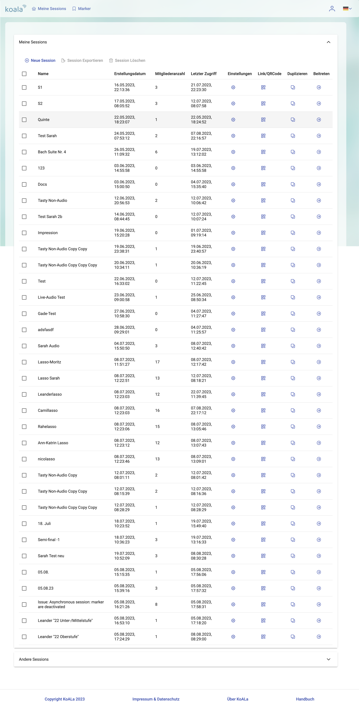

# Session verwalten {#guide-erste-schritte-sessionverwaltung}

Sie können Ihre eigenen Sessions sowie jene, an denen Sie 
teilgenommen haben, in der Sessionübersicht verwalten.
Sie erreichen diese jeder Zeit über den 
Menüpunkt *Meine Sessions* in der Kopfzeile des Fensters.

> TODO: Better picture with less sessions

## Mit mehreren Sessions interagieren

Mit den Elementen oberhalb der Tabelle können Sie mit einzelnen oder mehreren 
Sessions interagieren. Mehrere Sessions wählen Sie über die Checkboxen aus.
Sie können:

- Eine neue Sessions erstellen (􀁌 Neue Session)
- Eine oder mehrere Sessions exportieren ( Session Exportieren)
- Eine oder mehrere Sessions löschen ( Session Löschen)

> Die Knöpfe zum exportieren und löschen von Sessions werden erst aktiv, 
> wenn mind. eine Session über die Checkbox ausgewählt ist.

## Mit einer Session interagieren

Innerhalb eine Tabellenzeile agieren Sie mit dieser Session. Sie können

- die [Einstellungen](path/to/Sessioneinstellungen) bearbeiten, 
- sich den QR-Code und Link ansehen, mit dem sie Teilnehmer zu dieser 
  Session einladen können, 
- die Session duplizieren und
- die Session starten. 

> Tip: Sie starten die Session auch mit einem Klick auf den Tabelleneintrag.
