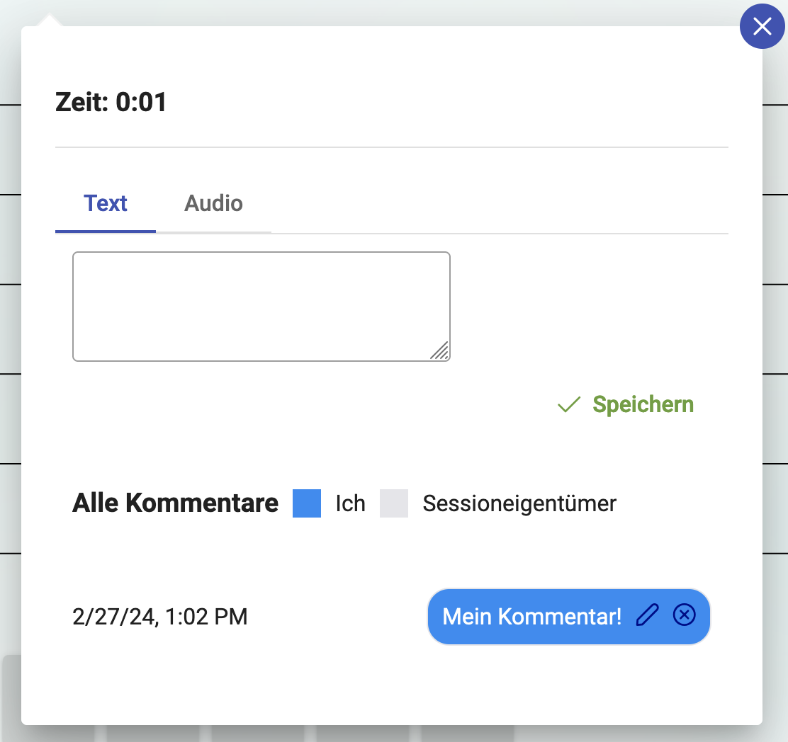
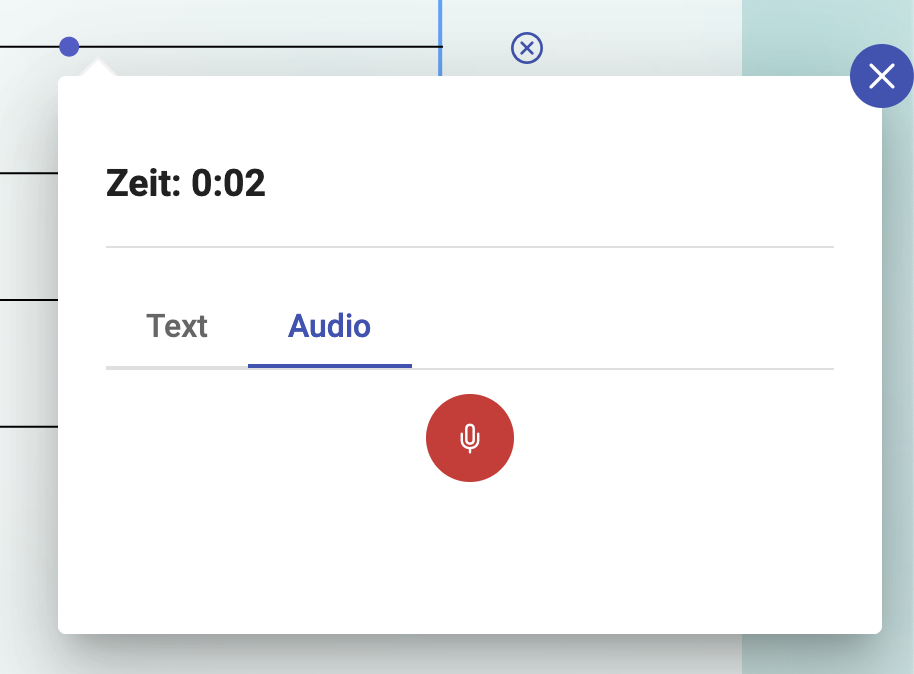

# Annotationen {#guide-erste-schritte-annotationen}

In der Session sehen Sie zunächst oben Ihren Player. Links vom Player befindet sich der Play- Button (Dreieck) sowie der Stop- Button (Quadrat). Auf der rechten Seite sehen Sie ein Lautsprecher- Symbol. Hier können Sie den Ton des Players ein- oder ausstellen.
Unter dem Player sieht man die Zeit. 

Darunter befinden sich Linien, auf denen Ihre Annotationen angezeigt werden.  Die Farbe der Markierung auf der Linie entspricht der Farbe des Markers.

Links neben den Linien stehen die Abkürzungen beziehungsweise das Icon der Marker. Wenn ein Marker eine Abkürzung und ein Icon hat, wird das Icon angezeigt.

Rechts neben den Linien befinden sich Kreuze. Hier können Sie die Annotationen des Markers löschen, wenn das Löschen nicht in den [Freigaben](docs/terms/Freigaben.md) gesperrt wurde. 

Sobald Sie den Player starten wird die Audio Datei abgespielt und Sie können beginnen zu annotieren. Wichtig: Die Bearbeitung muss vom Session Owner aktiviert worden sein (siehe [Freigaben](docs/terms/Freigaben.md)). Falls das nicht der Fall sein sollte, bleiben die Markern deaktiviert.

1. **[Event Marker](/docs/terms/Event-Marker.md):** Event Marker müssen nur einmal betätigt werden. Die Annotation lässt sich am Kreis auf der jeweiligen Linie erkennen. 
2. **[Range Marker](/docs/terms/Range-Marker.md):** Sobald der Range Marker betätigt wird ist er aktiv und es erscheint ein bunter Strich auf der Linie. Außerdem erscheint das Wort "Stop" auf dem Marker, wenn er aktiv ist. Um den Marker zu deaktivieren, muss er nochmal angeklickt werden. 
3. **[Slider Marker](/docs/terms/Slider-Marker.md):** Der Slider Marker ist sobald der Player läuft aktiv. Um den Wert des Markers zu ändern muss man den Regler auf dem Marker verschieben. Links befindet sich der niedrigste Wert, rechts der höchste.  Auf der Linie sind Rechtecke sichtbar, die höher sind, je höher der Wert ist. Alle negativen Werte sind unter der Linie. 

## Kommentare

Zusätzlich zur Annotationen mit einem Marker ist es in _koala_ möglich Kommentare an Annotationen anzuhängen. Einerseits bietet dies die Möglichkeit, dass die Teilnehmer\*innen einen freien Marker zur Verfügung haben, mit dem sie auch ohne konkrete Aufgabe Gedanken zum Stück festhalten können. Andererseits lassen sich die Kommentare auch als Kommunikationsmittel nutzen, um über eine Stelle zu sprechen.

Dass eine Annotation einen Kommentar enthält, sieht man an der kleinen Sprechblase, die über der Annotation angezeigt wird. Vgl. auch folgende Abbildung.

Einen Kommentar erstellt man, indem man auf eine Annotation klickt. Es öffnet sich ein Fenster, in dem man zwischen Text- und Audiokommentar wählen kann.

### Text-Kommentar
Der Textkommentar lässt sich in dem Textfeld eingeben anschließend drückt man auf Speichern. Die Abbildung unten zeigt das Eingabefenster und die Kommentarhistorie, die als „Chatverlauf“ angezeigt wird.

### Audio-Kommentar
Der Audiokommentar funktioniert ähnlich wie der Textkommentar. Es wird wie in der folgenden Abbildung ein roter Aufnahmeknpof angezeigt. Wenn man den Button drückt startet automatisch eine Aufnhame (evtl. muss man dem Browser den Zugriff auf das Mirkofon erlauben). Erneutes Drücken des Aufnahmebuttons stoppt die Aufnahme und man wird gefragt ob man die Aufnahme verwenden möchte, oder eine neue Version aufnehmen will. Erst nach erneutem Klick auf den Speichern Button wird die Aufnahme auch hochgeladen und steht danach in der Session zur Verfügung.

