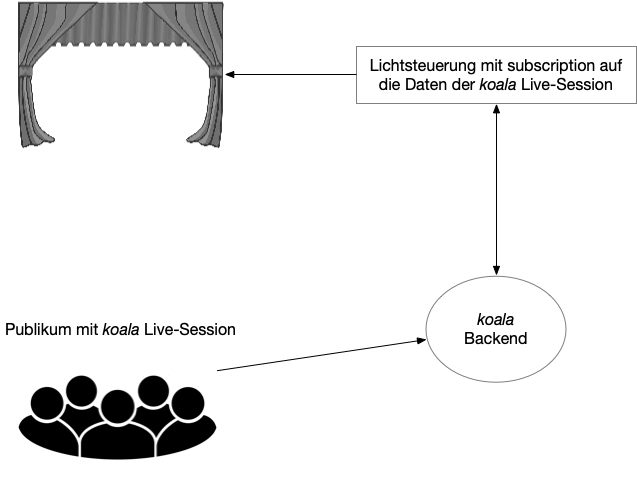

# Live Einsatz

Die _koala_-App bietet eine Programm-Schnittstelle, die auch für den Einsatz in live Konzerten genutzt werden kann. Sie eignet sich z.B. um Publikumseindrücke einzusammeln und evtl. auch live in die Aufführung mit einzubeziehen. Das Kernstück bietet dabei die GraphQL Schnittstelle. Was mit _koala_ gesteuert werden soll, ist frei konfigurierbar und auch nicht Teil der App. _koala_ fungiert in den Szenarien als graphische Benutzeroberfläche für das Publikum und als Datenaggregator.

Die folgenden zwei Beispiele skizzieren zwei Ideen, was man mit den von _koala_ eingesammelten Daten alles machen könnte.

## Beispiel 1: Live Performance mit Lichtsteuerung

In diesem Beispiel geht es um die Lichtsteuerung auf der Bühne, die durch das Publikum beeinflusst wird. Ziel könnte es sein, dass die Personen auf der Bühne mit dem Publikum interagieren möchten, indem sie sich die Aufgabe stellen, auf das Licht und die erzeugte Stimmung zu reagieren. Technisch kann dieses Szenario so umgesetzt werden:

### Für das Publikum

Das Publikum scannt zu Beginn z.B. mit Smartphones einen QR-Code und gelangt so in die Live-Session (ohne hinterlegtes Audiofile). Als Marker für die Live-Session werden verschiedene Farben angeboten. Sobald die Session von den Veranstalter\*innen/oder den Musiker\*innen startet wird, kann das Publikum auf der Zeitachse seine Farbwünsche angeben.

### Für die Bühne

Wenn die Session startet, verbindet sich ein Programm mit dem _koala_ Server und subskribiert -- wie das Publikum auch -- auf die Live-Session.

Das Programm erhält dann laufend die neuen „Annotationen“ des Publikums und kann sie statistisch auswerten und in eine Lichtkollage umsetzen. Als Schnittstellen kann die graphQL Schnittstelle direkt angesprochen werden. Für die Umsetzung in Lichtkolagen ist je nach Bühne ein entsprechender Wandler in das Lichtpult notwendig (OSC oder vergleichbare Schnittstellen müssten vorhanden sein).

Das Schaubild zeigt schematisch den Aufbau des Szenarios.

Es ist geplant eine rudimentäre Benutzeroberfläche für ein solches Programm auf der gitHub-Seite anzubieten.

## Beispiel 2: Publikumsbefragung

Dem Publikum wird entweder zu Beginn eines Konzerts oder zwischendurch aufgefordert, bei einer Live-Session mitzumachen (die Einladung kann per QR-Code auf dem Programmheft oder einer Projektion) angegeben.

Die Session startet ab dem Punkt, zu dem man Eindrücke sammeln möchte. Marker können entweder vorgegeben werden (im Stile von Text, Icons oder eMojis) oder als Kommentare gestaltet werden.

Parallel dazu empfiehlt es sich in den meisten Fällen die Veranstaltung mitzuschneiden, um später die Annotationen mit dem Konzert abgleichen zu können.
